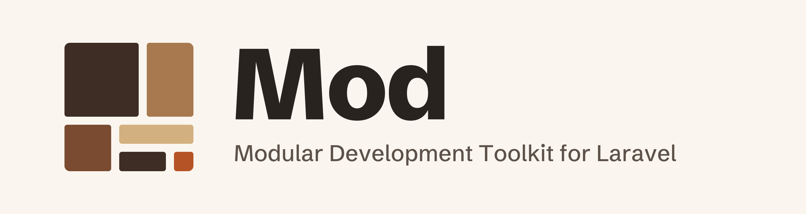

# Mod brand kit

The mark is **Corner**: six blocks of six different sizes packed into a square,
with the smallest, in the bottom-right corner, in Tey orange. It's the last
piece in, the one that completes the square: irregular modules arranged into
an organized whole.



## Source of truth

**[`build.mjs`](build.mjs)** produces every file in [`kit/`](kit/) and the
copies deployed to [`../docs/public/`](../docs/public/). Don't edit the
outputs; change the script and rebuild:

```bash
cd brand
npm install
npm run build
```

The script holds the mark's geometry, the Clay palette, the wordmark, and the
layouts for the banner and share card. Each mark is generated at the pixel size
it's used at, so every edge lands on a whole pixel at 16, 24 and 32 px.

The wordmark and all text on the banner and share card are drawn as outlines
from the fonts in [`fonts/`](fonts/), so they render the same everywhere:

| font | used for | licence |
|---|---|---|
| Schibsted Grotesk ExtraBold | the “Mod” wordmark | [OFL 1.1](fonts/OFL-SchibstedGrotesk.txt) |
| Schibsted Grotesk Medium | taglines and the site address | [OFL 1.1](fonts/OFL-SchibstedGrotesk.txt) |
| IBM Plex Mono Regular | the folder tree and commands on the share card | [OFL 1.1](fonts/OFL-IBMPlexMono.txt) |

The latin subsets have no box-drawing characters, so the generator draws the
tree's `├──` and `└──` connectors as lines on the monospace grid.

## The mark

Six rectangles on a 5 × 5 grid, every one a different size:

| piece | cells | area | colour on light | colour on dark |
|---|---|---|---|---|
| big square | 3 × 3, top left | 9 | umber | cream |
| tall block | 2 × 3, top right | 6 | tan | tan |
| square | 2 × 2, bottom left | 4 | clay | sand |
| wide bar | 3 × 1 | 3 | sand | clay |
| short bar | 2 × 1 | 2 | umber | cream |
| **the last piece** | 1 × 1, bottom right | 1 | **Tey orange** | **Tey orange** |

- **Gaps** are 1 px up to 31 px, then 1/16 of the size. The gaps separate the
  pieces, never the colour alone, so the mark reads in mono and reversed.
- **Corners:** the square's four outer corners take a radius of 1/24 of the
  size. Inner corners, where pieces meet, take half that, so each piece reads as
  its own block while the gaps stay even where pieces meet. At 16 px both round
  to almost nothing, which is fine.
- **Odd sizes:** when the grid can't divide evenly, the spare pixels go to
  matching outer cells, so the square stays square.

## Palette: Clay

Four steps around Tey orange, with a separate ramp for each surface. On both,
step 0 has the most contrast with the surface and step 3 the least.

| name | hex | surface | role | contrast |
|---|---|---|---|---|
| orange | `#B65326` | both | the last piece (Tey orange); one value everywhere | 4.58:1 on paper, 3.47:1 on dark |
| umber | `#3E2D24` | light | step 0: the big square and the short bar | 12.1:1 on paper |
| clay | `#7A4B30` | light | step 1: the 2 × 2 square | 6.8:1 on paper |
| tan | `#A8794F` | light | step 2: the tall block | 3.5:1 on paper |
| sand | `#D2B07F` | light | step 3: the wide bar | 1.9:1 on paper |
| cream | `#F4E9D8` | dark | step 0 | 14.3:1 on dark |
| sand (dark) | `#DCC3A0` | dark | step 1 | 10.1:1 on dark |
| tan (dark) | `#B88C62` | dark | step 2 | 5.7:1 on dark |
| clay (dark) | `#8F6446` | dark | step 3 | 3.3:1 on dark |
| ink | `#28231F` | light | the wordmark, mono mark, text | |
| paper | `#FAF6EF` | | the light surface, reversed mark, tiles | |
| dark | `#1E1B18` | | the dark surface the dark variants are drawn for | |
| muted | `#5C524A` | light | taglines on paper | 7.1:1 |
| muted (dark) | `#B5ABA0` | dark | taglines on dark | 7.6:1 |

The sand bar is quiet on paper (1.9:1) on purpose: it's the lightest step, and
the gaps, not its contrast, set it apart. **These are brand colours, not text
colours.** Don't use the Clay steps for links or body text; the docs keep
VitePress's own text colours.

## Files

All in [`kit/`](kit/).

| file | size | notes |
|---|---|---|
| `mark-light.svg` | 480 grid | for light surfaces, transparent |
| `mark-dark.svg` | 480 grid | for dark surfaces, transparent |
| `mark-mono.svg` | 480 grid | all ink, for print, stamps and embroidery |
| `mark-reversed.svg` | 480 grid | all paper, for dark or orange fields |
| `lockup-light.svg`, `lockup-dark.svg` | 240 high | mark + “Mod”, wordmark as outlines |
| `logo-light.svg`, `logo-dark.svg` | 24 × 24 | the docs header logo, drawn on the 24 px grid |
| `favicon.svg` | 16 × 16 | follows the tab's colour scheme: the light ramp by default, the dark ramp in a dark tab; transparent |
| `favicon.ico` | 16, 32, 48 | real PNGs at each size (also `favicon-16/32/48.png`) |
| `apple-touch-icon.png` | 180 × 180 | opaque paper tile |
| `avatar-512.png`, `avatar-1000.png` | 512, 1000 | GitHub and social avatar: full-bleed paper, no baked corner radius |
| `banner-light@2x.png`, `banner-dark@2x.png` | 1200 × 320 at 2× | README banner |
| `og-image.jpg` | 2400 × 1200, ~127 KB | share card (`og:image`) |
| `favicon-check.png` | | the favicon at 16 and 32 px on light and dark tabs, at 8×: the full mark (top) and the fallback cut (bottom) |

### The favicon at 16 px

At 16 px the orange corner is 3 × 3 px. It still reads on white, grey, and both
dark tab colours (see `favicon-check.png`), so the favicon uses the full mark
at every size. The generator also defines `CORNER_CUT`, a four-piece version on
a 3 × 3 grid with the same orange corner at 5 × 5 px, as the fallback if that
ever stops being true.

### The share card

The mark and name, large, over the real `app/Modules/` tree and the `mod:*`
commands that build it, from the “Self-Contained Modules” section of mod's
README. The tree and commands are faded to 0.52, so they stay visible in print
and on projectors. The name stays legible at the 255 px thumbnail LinkedIn
uses. If the README example changes, update `TREE` and `COMMANDS` in
`build.mjs` and rebuild.

## Deployed copies

`npm run build` copies these into `../docs/public/`:
`favicon.svg`, `favicon.ico`, `apple-touch-icon.png`, `og-image.jpg`,
`logo-light.svg` and `logo-dark.svg`.

[`.vitepress/config.mts`](../.vitepress/config.mts) links them with `?v=2`.
**When a deployed file changes, bump `?v=` there** (and `ASSET_VERSION` in
`build.mjs`, which records it): the CDN caches icons and images for hours.

## Rules

- **The orange is always the last piece**, the 1 × 1 in the bottom-right
  corner. Don't move it, recolour it, or add orange anywhere else in the mark.
- **One orange value everywhere**, `#B65326`, on light and dark.
- **Use the ramp for the surface**: `mark-light` on light, `mark-dark` on dark.
  On a busy or coloured field, use `mark-mono` or `mark-reversed`.
- **Keep the gaps.** Don't close them up or replace them with outlines: they
  carry the separation in mono and reversed.
- **Don't redraw the wordmark in live text.** Use the lockup files; they're
  outlines.
- **Opaque tiles have square corners.** GitHub, social sites and iOS mask them.
- **The mark is original.** It isn't based on any third-party kit, and nothing
  here may be replaced with Tailwind Plus or other licensed components.

The exploration that led here, from the first four directions to this mark, is
in [`review.html`](review.html).
